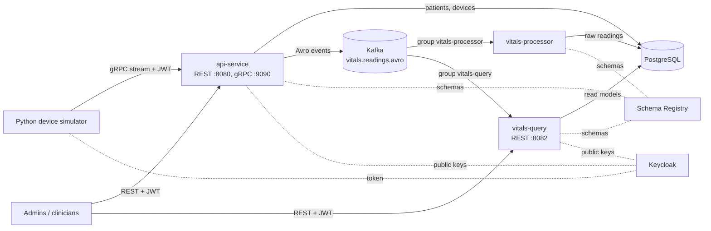

# VitalStream

An event-driven platform for medical-device data. Simulated bedside devices stream vital signs over gRPC;
readings flow through Kafka as Avro events into an append-only store and into query-optimised read models;
every API is protected by Keycloak-issued JWTs. Built with Java 21 / Spring Boot 3, Kafka, PostgreSQL,
Keycloak and a Python device simulator, and deployable to Kubernetes.

It's a learning project, built in seven phases; each phase is tagged (`phase-2-complete` ... `phase-7-complete`).

## Architecture



| Service | Role |
|---|---|
| **api-service** | Command side. REST for patients and devices; ingests readings over REST and gRPC (unary and bidirectional streaming), validates them and publishes Avro events to Kafka. |
| **vitals-processor** | Consumes events and stores every reading in PostgreSQL (the `vitals` schema). Idempotent, with retries and a dead-letter topic. |
| **vitals-query** | Query side (CQRS). Its own consumer group builds read models (latest vitals per patient, per-minute statistics per device) and serves them over REST. Rebuildable by replaying Kafka. |
| **simulator** | Python gRPC client simulating devices with realistic, drifting vitals; retries, resends and token handling. |

## Tech stack

Java 21 · Spring Boot 3.5 (Web, Data JPA, JDBC, Kafka, Security / OAuth2 resource server, Actuator) ·
Spring gRPC · PostgreSQL 16 + Flyway · Apache Kafka 4 (KRaft) · Avro + Confluent Schema Registry ·
Protocol Buffers / gRPC · Keycloak 26 (OIDC, JWT) · Python 3.12 (grpcio) · Testcontainers · GitHub Actions ·
Docker · Kubernetes (kustomize)

## Highlights

- **Reliable event pipeline**: at-least-once delivery made effectively-once by client-chosen reading ids
  (idempotency keys), idempotent consumers, a dead-letter topic with retry/backoff, and in-order resends
  after a broken stream. Verified by killing and freezing services mid-stream.
- **Schema evolution**: one shared Avro schema, code generated for every service, `BACKWARD_TRANSITIVE`
  compatibility enforced by the registry, fields added without breaking running consumers.
- **CQRS read models**: deterministic, order-independent projections, rebuilt from the log in seconds
  (~23,000 events/s with batching); compared against tuned raw-table queries with `EXPLAIN ANALYZE`
  (e.g. latest vitals: 53 ms → 0.02 ms). Query tuning notes in [`scripts/`](scripts/).
- **Security**: Keycloak realm as code; REST and gRPC as OAuth2 resource servers with role-based rules
  (`admin`, `clinician`, `device`), audience checks, machine identities via client credentials, and every
  reading attributed to the identity that submitted it.
- **Tested and deployable**: Testcontainers integration tests against real Postgres and Kafka, CI on every
  push, a layered multi-stage Docker image, Kubernetes manifests with probes, resources and rolling updates.

## Repository layout

```
api-service/         command side: REST + gRPC, publishes events
vitals-processor/    stores readings (Kafka -> PostgreSQL)
vitals-query/        CQRS read models + query API
simulator/           Python gRPC device simulator
schemas/             shared contracts: avro/ (Kafka events), proto/ (gRPC)
keycloak/            realm definition (roles, users, clients) - see its README
k8s/                 Kubernetes manifests + deploy script - see its README
scripts/             data generators, query-tuning and read-model comparison SQL, read-model rebuild
docker-compose.yml   local infrastructure
Dockerfile           one multi-stage image build for all three Java services
```

## Running locally

Prerequisites: Docker Desktop, Java 21+, Python 3.12.

**1. Infrastructure** (PostgreSQL, Kafka, Schema Registry, Kafka UI, Keycloak):

```bash
docker compose up -d
```

| Component | Address |
|---|---|
| PostgreSQL | `localhost:5433` (vitalstream / vitalstream) |
| Kafka | `localhost:9092` |
| Kafka UI | http://localhost:8085 |
| Schema Registry | http://localhost:8086 |
| Keycloak | http://localhost:8180 (admin console: admin / admin) |

**2. Services**, each in its own terminal:

```bash
cd api-service && ./mvnw spring-boot:run        # REST :8080, gRPC :9090
cd vitals-processor && ./mvnw spring-boot:run   # :8081
cd vitals-query && ./mvnw spring-boot:run       # :8082
```

**3. Simulator:**

```bash
cd simulator
python3 -m venv .venv && .venv/bin/pip install -r requirements.txt
./generate.sh
.venv/bin/python sim.py --create 3      # registers a patient and 3 devices, then streams readings
.venv/bin/python sim.py --help
```

## Using the APIs

All APIs need a token from Keycloak. Development users and clients (defined in
[`keycloak/realm-vitalstream.json`](keycloak/realm-vitalstream.json), local use only):

| Identity | Credentials | Role | May |
|---|---|---|---|
| `bob` | bob / bob | admin | manage patients and devices |
| `alice` | alice / alice | clinician | view patients, devices and vitals |
| `device-simulator` client | secret `device-simulator-secret` | device | send readings |

```bash
TOKEN=$(curl -s http://localhost:8180/realms/vitalstream/protocol/openid-connect/token \
  -d grant_type=password -d client_id=vitalstream-cli -d username=alice -d password=alice \
  | python3 -c 'import json,sys; print(json.load(sys.stdin)["access_token"])')

curl -s -H "Authorization: Bearer $TOKEN" localhost:8080/api/patients
curl -s -H "Authorization: Bearer $TOKEN" localhost:8082/api/patients/1/vitals/latest
curl -s -H "Authorization: Bearer $TOKEN" "localhost:8082/api/devices/1/vitals/HEART_RATE/stats?bucket=hour"
```

| Endpoint | Role |
|---|---|
| `GET/POST/PUT/DELETE /api/patients`, `/api/devices` (api-service) | GET: admin, clinician · writes: admin |
| `POST /api/devices/{id}/readings` (api-service) | device |
| gRPC `vitalstream.ingest.v1.IngestService` (`SendReading`, `StreamReadings`) | device |
| `GET /api/patients/{id}/vitals/latest` (vitals-query) | admin, clinician |
| `GET /api/devices/{id}/vitals/{metric}/stats?bucket=minute\|hour\|day&from&to` (vitals-query) | admin, clinician |

## Tests and CI

```bash
cd api-service && ./mvnw verify          # also vitals-processor; needs Docker (Testcontainers)
```

The integration tests start real PostgreSQL and Kafka containers, use Avro's in-memory schema registry, and
supply test JWTs instead of Keycloak. [GitHub Actions](.github/workflows/ci.yml) runs them for every service
on each push and pull request, builds the three container images, and checks the simulator against the
current `.proto`.

## Kubernetes

The whole system (infrastructure included) deploys to a local cluster such as Docker Desktop's:

```bash
docker compose stop                 # frees the ports and memory
k8s/deploy.sh --build               # build the images and apply the manifests
kubectl get pods -n vitalstream -w
```

The same localhost ports then serve the cluster. See [`k8s/README.md`](k8s/README.md) for updating,
inspecting and tearing down.

## Project phases

| Phase | Topic |
|---|---|
| 1 | Spring Boot REST + PostgreSQL + Flyway + JPA |
| 2 | Kafka producer/consumer, idempotency, dead-letter topic |
| 3 | Avro + Schema Registry, schema evolution |
| 4 | gRPC ingest (unary + streaming) + Python simulator, retries and keepalive |
| 5 | Query tuning + CQRS read models, rebuild from the log |
| 6 | Keycloak OIDC/JWT, role-based access for REST and gRPC |
| 7 | Testcontainers, GitHub Actions CI, container images, Kubernetes |

## Not production-ready

Deliberate shortcuts for a local learning setup: development credentials in the repository, plaintext
(no TLS) between all components, single-instance Kafka/PostgreSQL/Keycloak, and Keycloak in dev mode.
